# 🛑 Work in progress 🛑


# Preview current state :

## [```Main screen (App)```](./APPJPN/App.tsx)
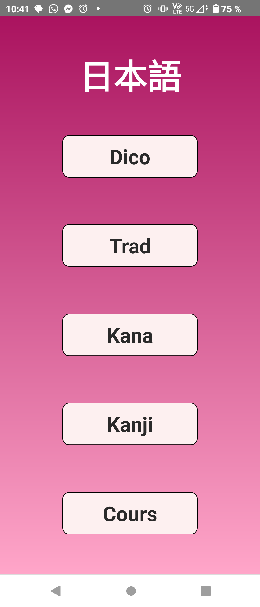v2.1
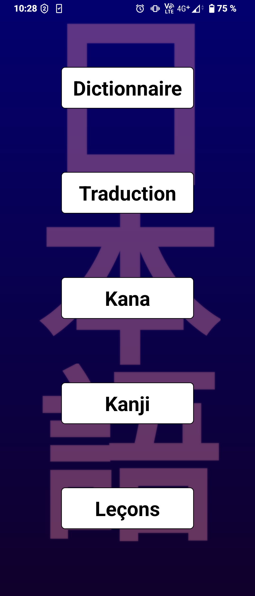v2.2


## [```Dico screen```](./APPJPN/components/DicoScreen.tsx)
v2.1
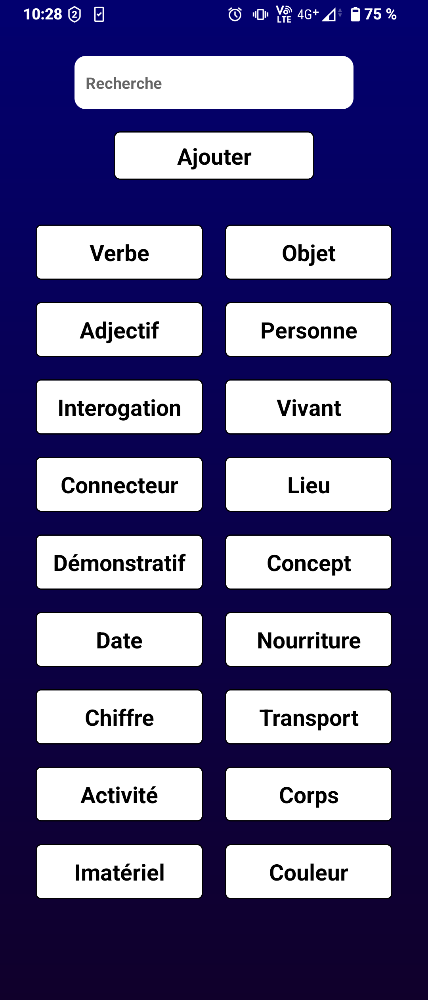v2.2

### [```Dico category screen```](./APPJPN/components/dico/DicoCategoryScreen.tsx)   ("verbe" category selected)
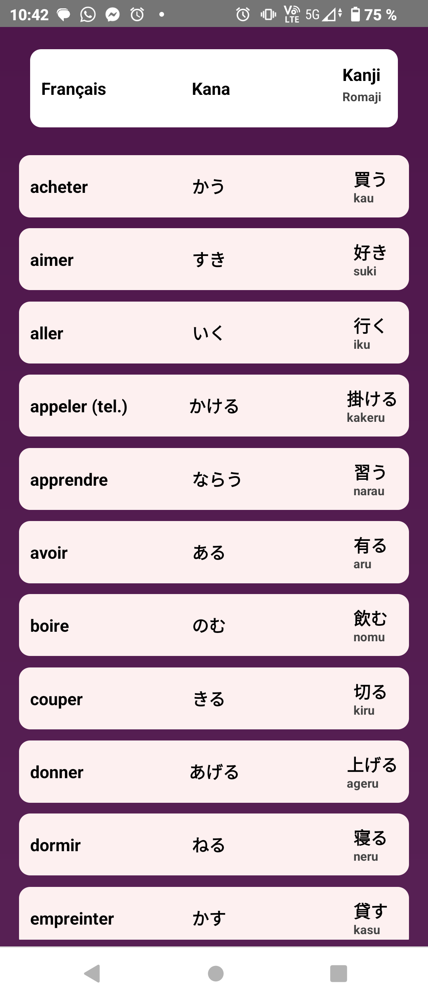v2.1
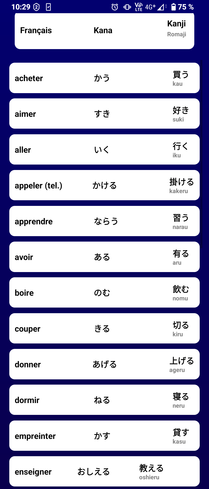v2.2

### [```Dico search screen```](./APPJPN/components/dico/DicoSearchScreen.tsx)   (search "u" here)
v2.1
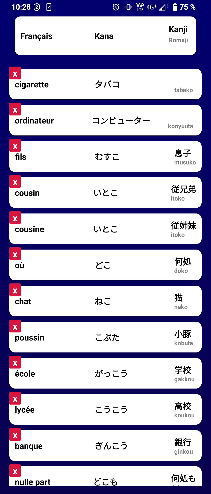v2.2

### [```Dico add screen```](./APPJPN/components/dico/DicoAddScreen.tsx)
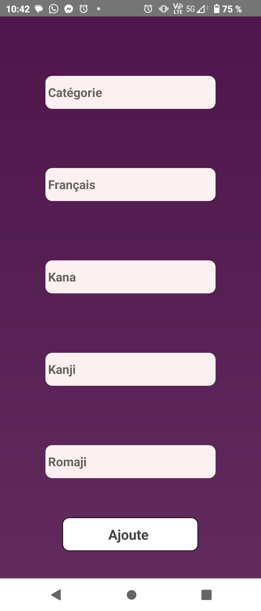v2.1
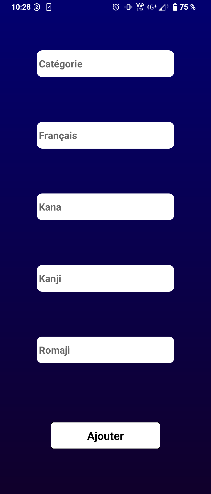v2.2


## [```Traduction screen```](./APPJPN/components/TradScreen.tsx)
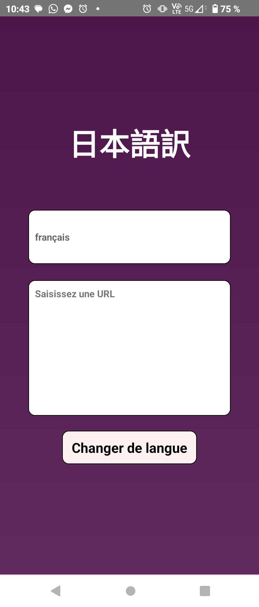v2.1
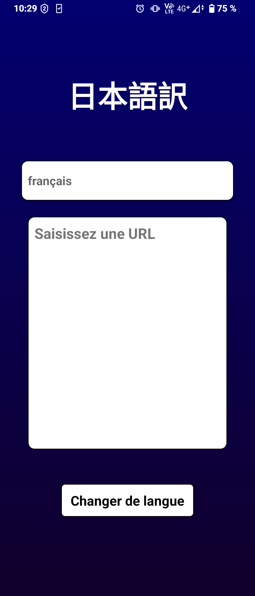v2.2


## [```Kana screen```](./APPJPN/components/KanaScreen.tsx)
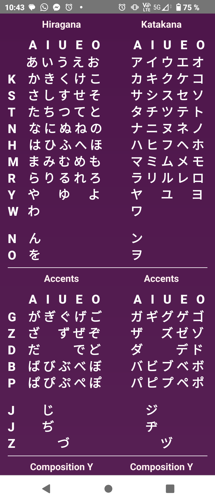v2.1
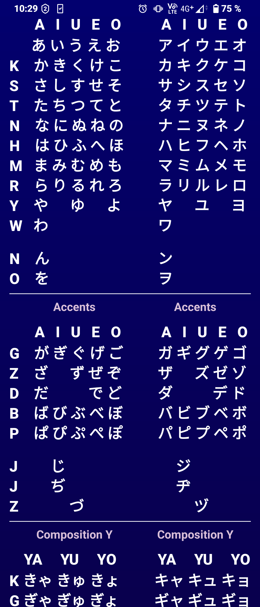v2.2


## [```Kanji screen```](./APPJPN/components/KanjiScreen.tsx)   (here asking for "ame 雨")
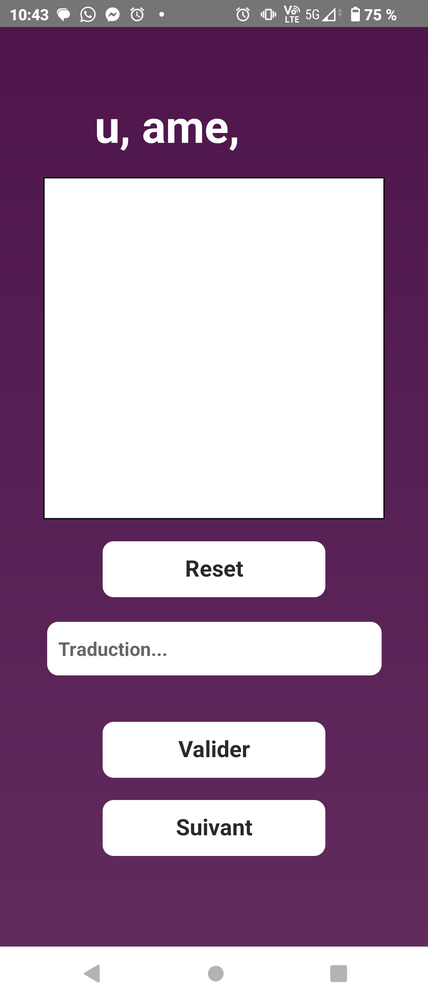v2.1
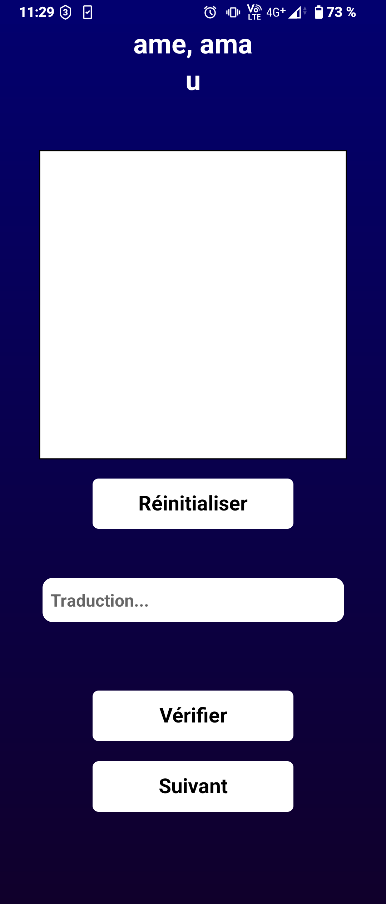v2.2

### [```Kanji answer screen```](./APPJPN/components/KanjiScreen.tsx)
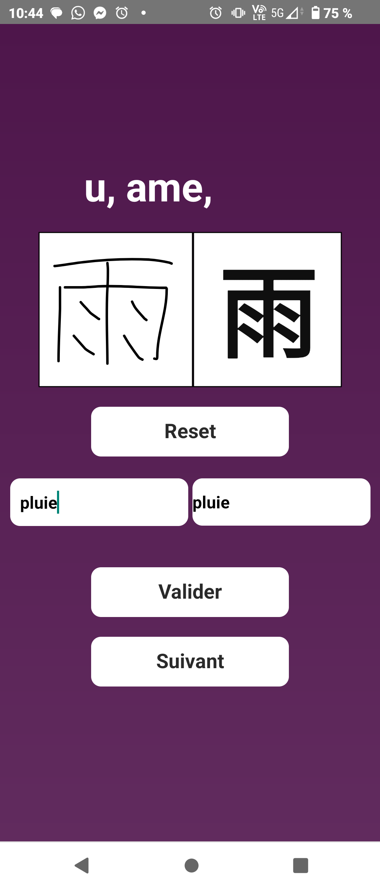v2.1
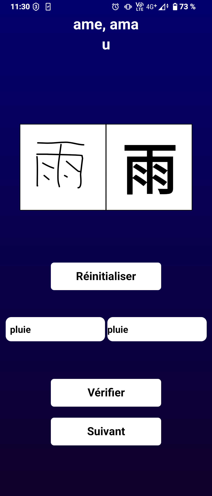v2.2


# Data location :
Kanji (static) : [```kanji.json```](./APPJPN/components/kanji/kanji.json)

Dictionary (dynamic) : [```dico.json```](./APPJPN/android/app/src/main/assets/dico.json)