# 🛑 Work in progress 🛑


# Preview current state :

v1.0 => 01/2023 - 04/2023\
v1.1 => 05/2023 - 12/2023\
v1.2 => 2024

## [```Main screen (App)```](./APPJPN/App.tsx)
v1.1
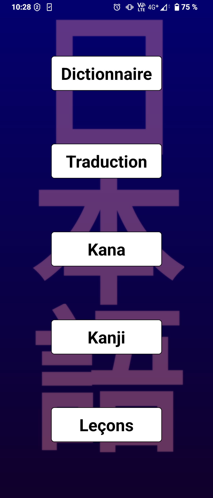v1.2


## [```Dico screen```](./APPJPN/components/DicoScreen.tsx)
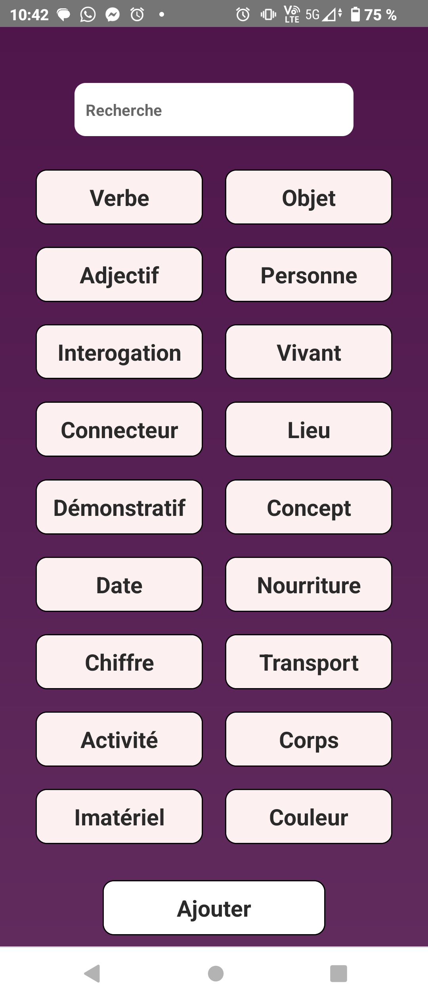v1.1
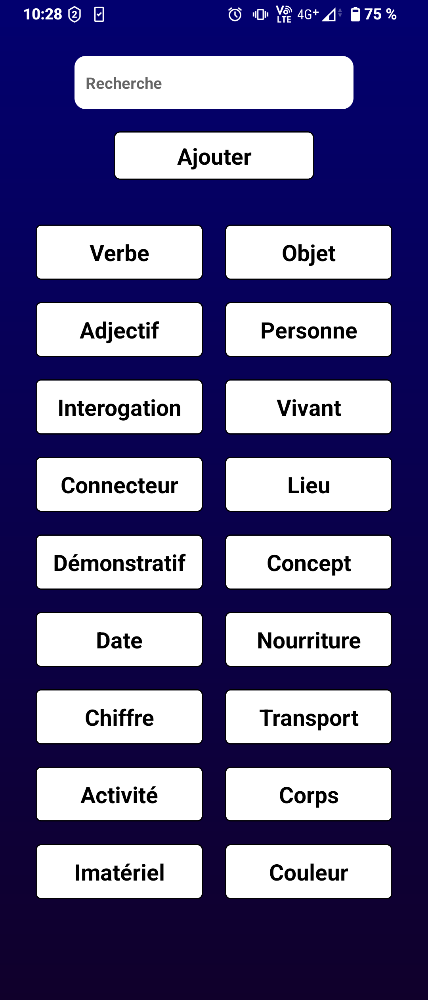v1.2

### [```Dico category screen```](./APPJPN/components/dico/DicoCategoryScreen.tsx)   ("verbe" category selected)
v1.1
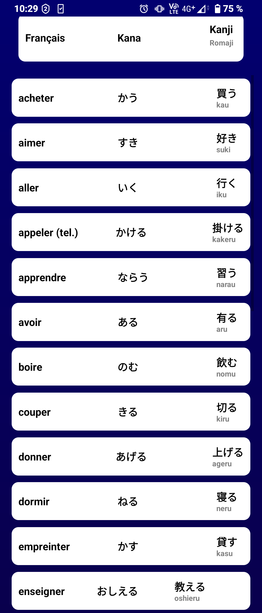v1.2

### [```Dico search screen```](./APPJPN/components/dico/DicoSearchScreen.tsx)   (search "u" here)
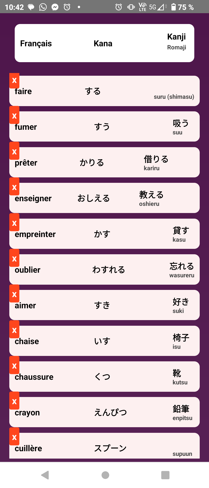v1.1
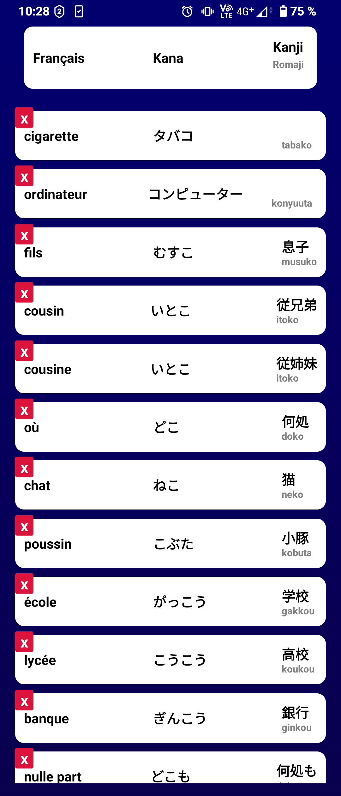v1.2

### [```Dico add screen```](./APPJPN/components/dico/DicoAddScreen.tsx)
v1.1
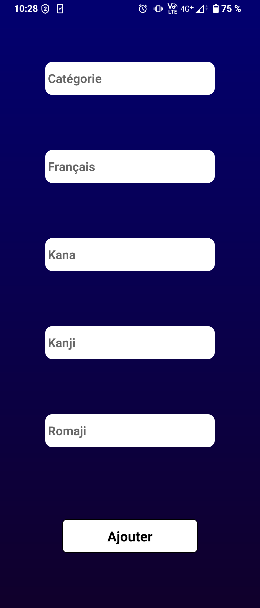v1.2


## [```Traduction screen```](./APPJPN/components/TradScreen.tsx)
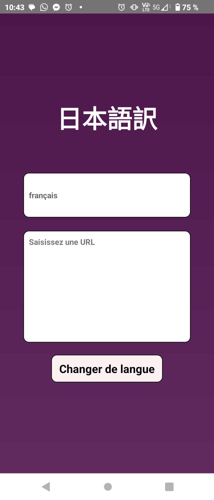v1.1
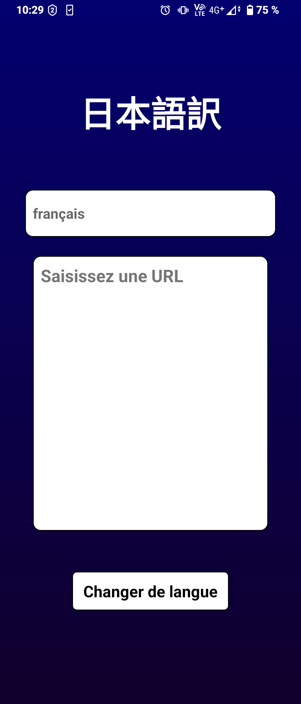v1.2


## [```Kana screen```](./APPJPN/components/KanaScreen.tsx)
v1.1
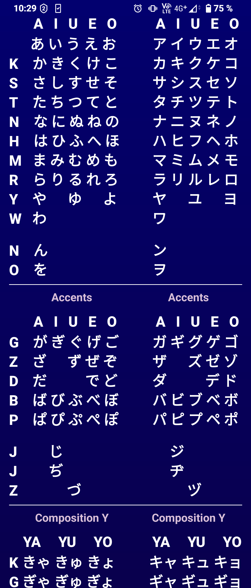v1.2


## [```Kanji screen```](./APPJPN/components/KanjiScreen.tsx)   (here asking for "ame 雨")
v1.1
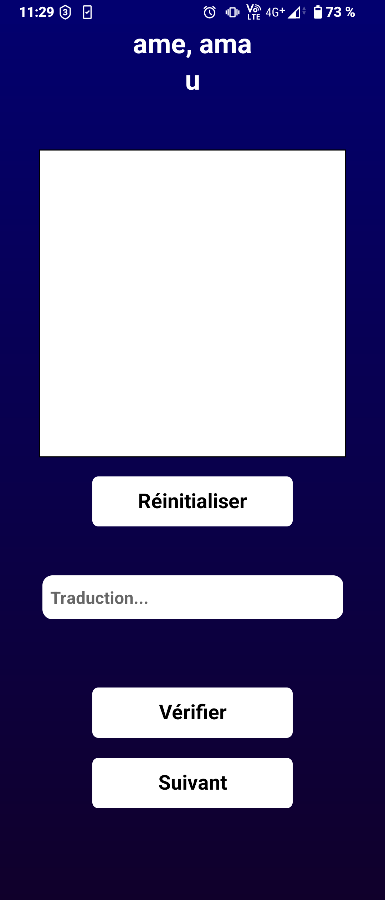v1.2

### [```Kanji answer screen```](./APPJPN/components/KanjiScreen.tsx)
v1.1
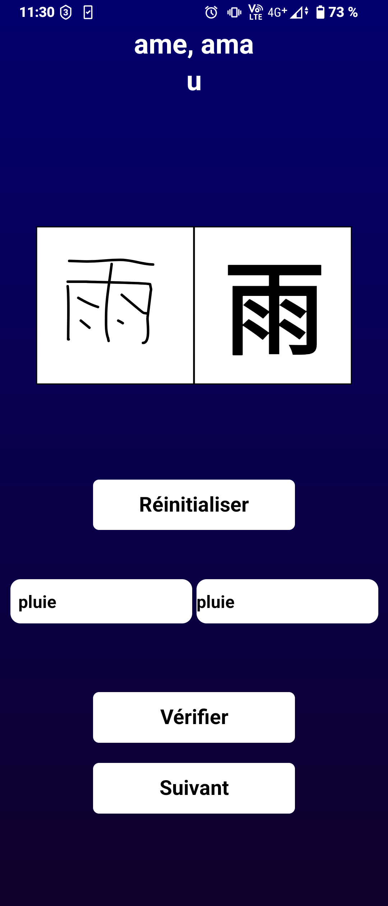v1.2


# Data location :

Static data are located in [```constants```](./APPJPN/constants/) folder, and organized like this :\
├── lesson\
│   ├── [```_lessonsName_.json```](./APPJPN/constants/lesson/_lessonsName_.json)\
│   ├── [```1_verb.json```](./APPJPN/constants/lesson/1_verb.json)\
│   └── . . .\
└── [```kanji.json```](./APPJPN/constants/kanji.json)

Dynamic data are located in [```assets```](./APPJPN/android/app/src/main/assets/) folder, and organized like this :\
└── [```dico.json```](./APPJPN/android/app/src/main/assets/dico.json)